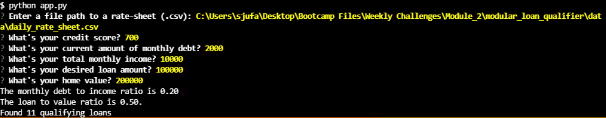

# Modular Loan Filtering Application
The goal of this project is to implement a loan filtering program that will allow users to filter loan availability based on credit, monthly debt and income, and other parameters.  It will filter through a list of lenders from `daily_rate_sheet.csv` or a user specified file path and based on their criteria export a list of qualifying loans to a *.csv file.

---

## Technologies

In this project we will be utilizing python 3 and the following dependencies --  
[Questionary](https://github.com/tmbo/questionary) -- Streamlines gathering input via a cli interface allowing for user input in a variety of forms  
[Python Fire](https://github.com/google/python-fire) -- Generates a cli interface for enhanced interactivity with the app

---

## Installation Guide

The dependencies listed above can be installed using the following command prompts in the terminal:  

Python Fire -- `pip install fire`  
Questionary -- `pip install questionary`  

---

## Usage

In order to run the main application, from the terminal within the modular_loan_qualifier folder input `python app.py`.  Once ran you will be prompted to provide a file path for your bank loan criteria.  You may use the provided [daily_rate_sheet_csv](data/daily_rate_sheet.csv) as an example or import a file of your choosing.  You will then be prompted to enter qualifying criteria to filter qualifying loans as indicated by the screen shot below --  

  
  
If there are no qualifying loans, the system will exit.  It there are qualifying loans, you will have the option to save and export them to a user specified file path that is inputted via the CLI.

---

## License

Licensed under the [MIT License](https://github.com/git/git-scm.com/blob/main/MIT-LICENSE.txt)  Copyright 2021 Dave Thomas.
